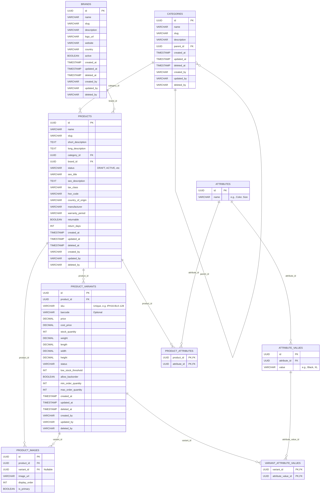

# Phase 2: Enterprise Product Catalog Management (Finalized)

This plan outlines the finalized architecture for a highly scalable, production-ready Product Catalog that supports unlimited product variants, dynamic attributes, enterprise soft-deletes, and advanced e-commerce fields.

## 1. Database Architecture & ER Diagram

### ER Diagram

## 2. Core Architectural Decisions

- **Soft Delete Strategy:** All major entities include `deleted_at`, `deleted_by`, `created_by`, `updated_by`. Records are never physically deleted. `status` is also set to `ARCHIVED`.
- **Supabase Storage:** Implemented via a `StorageService` interface. Images are uploaded to a public bucket, and only the public URL is stored in the DB.
- **Inventory Future-proofing:** Inventory tracking logic will be strictly separated. Stock levels are currently maintained on `ProductVariant`, but the service layer will be designed so a future `InventoryTransaction` module can be injected easily.
- **Images:** Polymorphic approach. Images belong to a Product, but can optionally belong to a specific Variant, allowing unlimited images and variant-specific overrides.

## 3. Implementation Order

1. Flyway Migration (Database)
2. JPA Entities (With Auditing setup)
3. Repository Layer
4. DTOs
5. MapStruct Mappers
6. Services (`StorageService` interface, `ProductService`, etc.)
7. Controllers (Secured via Roles)
8. Validation (Jakarta Validation)
9. Security Integration
10. Swagger Documentation
11. React Admin Pages (Dashboard, Product Builder)
12. React Customer Pages (Storefront, Product Display)
13. API Integration
14. Testing

## 4. Completion Deliverable
Phase 2 will NOT transition automatically to Phase 3. A comprehensive review artifact will be provided covering ER diagrams, endpoints, postman collections, frontend screenshots, and tests.
